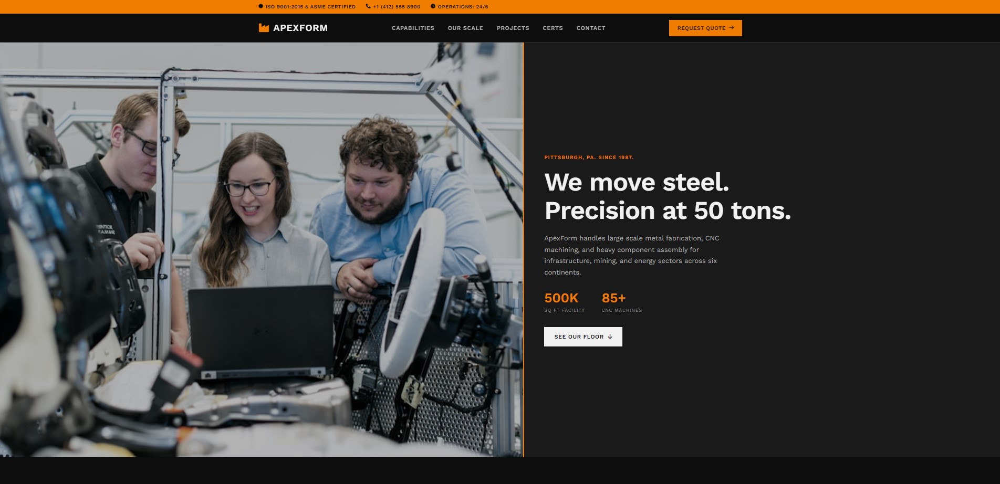

# ApexForm Industries Website

Website resmi untuk ApexForm Industries, perusahaan manufaktur heavy fabrication dan precision machining yang berbasis di Pittsburgh, PA. Dibangun dengan tampilan industrial brutalist yang solid, fokus menampilkan kapabilitas teknis dan skala produksi tanpa embel embel visual yang tidak perlu.

## Preview

## Fitur

- Sticky navbar dengan perubahan style saat di scroll
- Hero section asimetris dengan foto fasilitas dan statistik kapasitas
- Grid kapabilitas manufaktur dengan hover micro interaction
- Animasi counter statistik (tonase, jumlah mesin, proyek, negara ekspor) saat masuk viewport
- Katalog project dengan efek gambar grayscale ke warna saat hover
- Sertifikasi dan partner dalam layout compact
- Form RFQ minimalis dengan styling industrial
- Fully responsive dari mobile sampai desktop
- Scroll reveal animation menggunakan Intersection Observer API vanilla

## Teknologi yang digunakan

- HTML5
- CSS3 (Grid, Flexbox, Custom Properties, Transitions)
- JavaScript (vanilla, Intersection Observer API)
- Font Awesome 6.5.1 (via CDN)
- Google Fonts (Work Sans)
- Gambar dari Unsplash

## Live demo
https://muhammadalimurtadho.github.io/apexform-industries-website/
